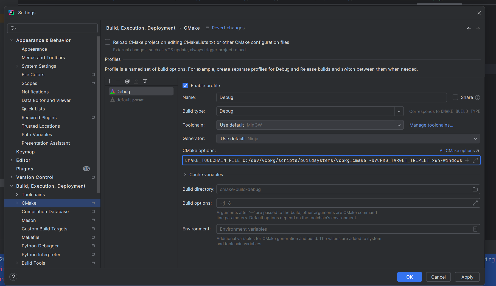
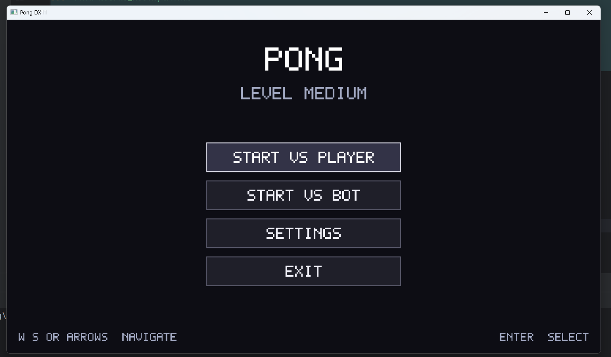
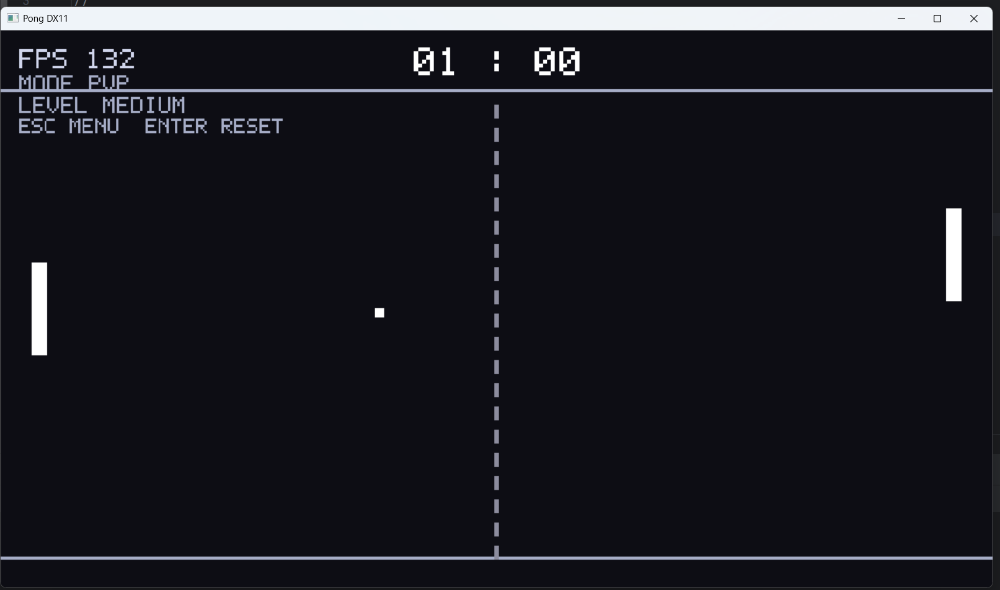

# Ping Pong

Простой 2D Pong на C++ с оконным приложением под Windows, своей базовой архитектурой, вводом с клавиатуры, рендером через DirectX и разделением на модули: приложение, окно, ввод, графика, UI, физика и игровая логика.

---

## Содержание

- [Core](#core)
- [Installation third-party libraries](#installation-third-party-libraries)
- [Launch](#launch)
- [Game play](#game-play)
- [Управление](#управление)
- [Структура проекта](#структура-проекта)
- [Как это работает по шагам](#как-это-работает-по-шагам)

---

# Core

Ниже объяснение **максимально по-человечески**, без пафосной ерунды.

## Общая идея

Игра состоит из нескольких крупных частей:

1. **Application**  
   Это главный управляющий объект. Он создаёт окно, графическое устройство, ввод и запускает игровой цикл.

2. **Window**  
   Это обычное окно Windows. Оно принимает сообщения системы: закрытие окна, клавиатура, фокус и так далее.

3. **InputSystem**  
   Считывает нажатия клавиш и превращает их в удобные игровые команды.  
   Например:
    - `W / S` двигают левую ракетку
    - `Up / Down` двигают правую ракетку
    - `Enter` подтверждает выбор в меню
    - `Escape` возвращает в меню

4. **GraphicsDevice / ShapeRenderer2D / BitmapFont**  
   Это слой рендера.
    - `GraphicsDevice` поднимает Direct3D 11
    - `ShapeRenderer2D` рисует прямоугольники
    - `BitmapFont` рисует текст

5. **PongGame**  
   Это главная игровая логика.  
   Она решает:
    - какой сейчас экран открыт
    - идёт ли матч или показано меню
    - кто забил очко
    - куда летит мяч
    - как работает бот
    - какая выбрана сложность

6. **Entities**  
   Простые игровые объекты:
    - `Paddle` - ракетка
    - `Ball` - мяч
    - `Wall` - линия-стена
    - `CenterLine` - центральный пунктир
    - `PlayField` - игровое поле
    - `ScoreBoard` - счёт и HUD

7. **Systems**  
   Отдельные системы, которые делают конкретную работу:
    - `PongRules` - правила и константы игрового поля
    - `PongCollisionSystem` - столкновения
    - `PaddleAI` - логика бота

8. **PongScene**  
   Это слой рендера игрового экрана.  
   Он не решает игровую логику. Он **только рисует**:
    - поле
    - мяч
    - ракетки
    - счёт
    - режим
    - сложность
    - FPS

---

## Как устроен игровой цикл

Каждый кадр происходит примерно одно и то же:

### 1. Обновление ввода
Система смотрит, какие клавиши были нажаты.

### 2. Update
`PongGame::Update(...)` решает, что делать дальше:
- если открыт `MainMenu`, обновляется меню
- если открыт `Settings`, обновляются настройки
- если открыт `Playing`, обновляется сам матч

### 3. Render
`PongGame::Render(...)` рисует нужный экран:
- меню
- настройки
- игровой экран

---

## Что такое `ScreenState`

Это текущее состояние интерфейса игры.

```cpp
enum class ScreenState : std::uint8_t
{
    MainMenu = 0,
    Settings,
    Playing
};
```
То есть игра всегда находится **в одном из трёх экранов**:

- `MainMenu` - главное меню
- `Settings` - выбор сложности
- `Playing` - сам матч

---

## Что делает `PongGame`

`PongGame` - это мозг игры.

Он хранит:
- текущий экран
- выбранный режим игры
- выбранную сложность
- счёт игроков
- левую и правую ракетку
- мяч
- состояние бота
- FPS
- кнопки меню

### Основные методы

#### `Initialize(AppContext& context)`
Инициализирует всё:
- кнопки главного меню
- кнопки меню настроек
- размеры ракеток
- размер мяча
- цвета объектов
- сцену рендера
- стартовые параметры матча

#### `Update(AppContext& context, float deltaTime)`
Обновляет игру каждый кадр:
- считает FPS
- проверяет, какой экран сейчас активен
- вызывает нужную игровую логику для меню, настроек или матча

#### `Render(AppContext& context)`
Рисует нужный экран:
- главное меню
- экран настроек
- игровой экран

---

## Что такое `AppContext`

`AppContext` - это контейнер с общими объектами приложения, чтобы не передавать в каждую функцию 10 разных параметров.

Обычно через него доступны:
- `Input`
- `Shape2D`
- `Font`
- и другие общие системы

То есть `AppContext` просто собирает всё важное в одном месте.

---

# Ping pong
## Installation third-party libraries
Install vcpkg in your pc
```bash
git clone https://github.com/microsoft/vcpkg.git C:\dev\vcpkg
cd C:\dev\vcpkg
.\bootstrap-vcpkg.bat
```
Next you should open your project folder in administration console
```bash
cd <PATH_TO_THE_PROJECT>\PingPong
set "VCPKG_ROOT=C:\dev\vcpkg"
set "PATH=%VCPKG_ROOT%;%PATH%"

vcpkg version

vcpkg new --application
vcpkg add port directxmath
vcpkg add port directxtk
```
Then add to Clion this settings
``-DCMAKE_TOOLCHAIN_FILE=C:/dev/vcpkg/scripts/buildsystems/vcpkg.cmake -DVCPKG_TARGET_TRIPLET=x64-windows``



and switch to Visual Studio in toolchain


## Game play
The main menu

Gameplay


## Как устроены игровые объекты

### `Paddle`

Ракетка хранит:

- позицию
- компонент движения
- коллайдер
- цвет

Умеет:

- возвращать ширину и высоту
- строить свой `AABB`

### `Ball`

Мяч хранит:

- позицию
- скорость
- коллайдер
- цвет

Умеет:

- возвращать размер
- строить свой `AABB`

### `Wall`

Это простая линия-стена. По сути прямоугольник, который рисуется сверху или снизу игрового поля.

### `CenterLine`

Это центральный пунктир на поле.

### `PlayField`

Это объект, который рисует:

- верхнюю стену
- нижнюю стену
- центральную линию
- левую ракетку
- правую ракетку
- мяч

### `ScoreBoard`

Это HUD. Он рисует:

- счёт
- FPS
- режим игры
- сложность
- подсказки управления

---

## Что такое `AABB`

`AABB` расшифровывается как **Axis-Aligned Bounding Box**.

Если по-простому, это обычный прямоугольник без поворота, который нужен для проверки столкновений.

В этой игре он используется для того, чтобы понять:

- ударился ли мяч о ракетку
- коснулся ли мяч верхней или нижней границы
- вылетел ли мяч за левый или правый край

Для Pong этого более чем достаточно. Тут не нужен цирк с полноценной физикой.

---

## Как работают столкновения

За это отвечает `PongCollisionSystem`.

### Что он делает

- проверяет столкновение мяча с верхней и нижней стенкой
- проверяет столкновение мяча с ракетками
- определяет, вылетел ли мяч за пределы поля

### Что происходит при столкновениях

- если мяч касается верхней стены, его вертикальная скорость разворачивается вниз
- если мяч касается нижней стены, его вертикальная скорость разворачивается вверх
- если мяч врезается в ракетку, пересчитывается новая траектория
- если мяч улетел за левый или правый край, начисляется очко

---

## Как работает бот

За это отвечает `PaddleAI`.

Бот не двигается идеально всегда, иначе это была бы не игра, а унылый симулятор человеческого поражения.

### Бот использует:

- скорость движения
- шанс ошибки
- длительность ошибки
- величину смещения от идеальной траектории
- множитель замедления во время ошибки

### Из-за этого:

- на `Easy` бот тупит чаще
- на `Medium` играет заметно лучше
- на `Hard` почти идеально отслеживает мяч

Сложность влияет не магически, а через конкретные параметры.

---

## Что делает `PongRules`

`PongRules` хранит общие игровые правила и параметры:

- границы игрового поля
- параметры сложности
- формат текста для HUD
- преобразование режима и сложности в человекочитаемый текст

Примеры методов:

- `GetPlayableTop()`
- `GetPlayableBottom()`
- `GetDifficultyTuning(...)`
- `BuildScoreText(...)`
- `BuildModeText(...)`
- `BuildDifficultyText(...)`

Это нужно, чтобы важные правила не были размазаны по проекту как попало.

---

## Что делает `PongScene`

`PongScene` отвечает только за **отрисовку игрового экрана**.

Он не занимается:

- обработкой ввода
- физикой
- подсчётом очков
- логикой меню

Он просто собирает gameplay-картинку из:

- `PlayField`
- `ScoreBoard`

То есть `PongGame` решает, **что происходит**, а `PongScene` решает, **как это нарисовать**.

---

## Что делает `PlayField`

`PlayField` рисует всё, что относится именно к арене:

- верхнюю линию-стену
- нижнюю линию-стену
- центральный пунктир
- две ракетки
- мяч

Это удобно, потому что вся графика поля лежит в одном месте, а не размазана по `PongGame.cpp`.

---

## Что делает `ScoreBoard`

`ScoreBoard` рисует HUD:

- счёт
- FPS
- текущий режим игры
- текущую сложность
- подсказки по кнопкам

Это отдельный класс, потому что HUD логически отличается от игрового поля.

---

## Почему проект разбит на модули

Потому что файл, в котором намешаны:

- цикл приложения
- ввод
- физика
- меню
- рендер
- счёт
- бот
- правила

это не архитектура, а помойка.

Разделение нужно, чтобы:

- код было проще читать
- код было проще чинить
- отдельные части можно было менять независимо
- проект было проще объяснить другому человеку
- было меньше шансов сломать всё одной правкой

---

## Логика классов по ролям

### Верхний уровень

- `Application`
- `PongGame`

### Игровые объекты

- `Paddle`
- `Ball`
- `Wall`
- `CenterLine`
- `PlayField`
- `ScoreBoard`

### Игровые системы

- `PaddleAI`
- `PongCollisionSystem`
- `PongRules`

### Рендер игрового экрана

- `PongScene`

---

## Если объяснить совсем просто

- `Application` запускает всё приложение
- `Window` создаёт окно
- `InputSystem` читает клавиатуру
- `PongGame` управляет логикой игры
- `PongScene` рисует игровой экран
- `PlayField` рисует арену
- `ScoreBoard` рисует HUD
- `PaddleAI` двигает бота
- `PongCollisionSystem` считает столкновения
- `PongRules` хранит игровые правила


